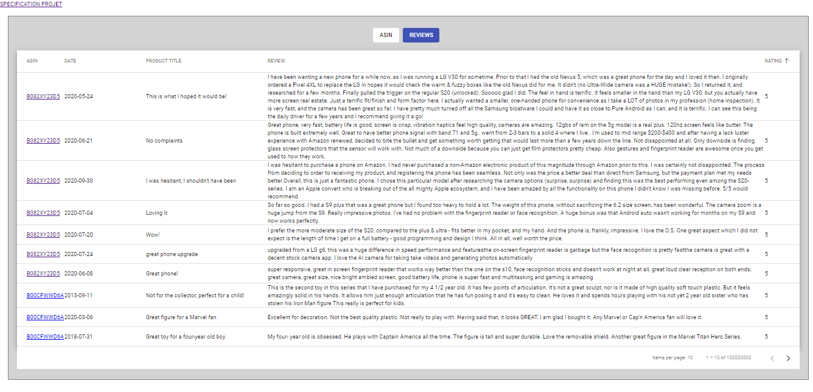

## Start project
- execute console batch:  START_PROJECT.bat

````batch
> START_PROJECT.bat
````

## Debug mode
- Open project (src/Asin.sln)
- start batch (src/Asin.Web/ClientApp/scripts/watch_app.bat)

````batch
> cd src/Asin.Web/ClientApp/scripts/
> watch_app.bat
````


## Home page

* Features
  * Add & indexing new ASIN code 

## Customer reviews page

* Features
  * column sort
  * paging